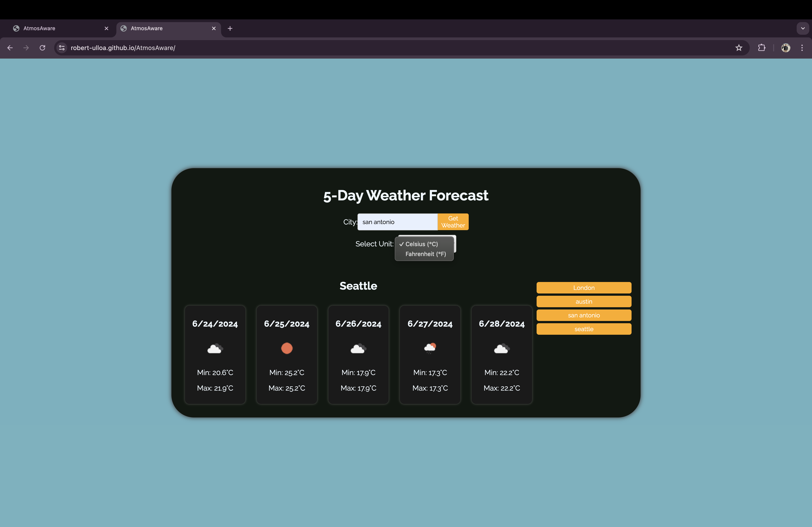

# AtmosAware
Welcome to the 5-Day Weather Dashboard! This application allows you to view the current and future weather conditions for multiple cities. The user-friendly interface helps you plan your trips by providing accurate weather forecasts.

# Features
- City Weather Search: Search for a city to get its current and 5-day weather forecast.
- Current Weather Conditions: Displays the city name, date, weather icon, temperature, humidity, and wind speed.
- 5-Day Forecast: Shows the date, weather icon, temperature, wind speed, and humidity for the next 5 days.
- Search History: Keeps a record of searched cities and allows you to click on a city to view its weather conditions again.
- Unit Selection: Toggle between Celsius (°C) and Fahrenheit (°F) to view the temperature in your preferred unit.

# Technologies Used
- HTML
- CSS 
- JavaScript
- OpenWeather API
- Google Fonts

## Deployment link
https://robert-ulloa.github.io/AtmosAware/

## Github link (repo)
https://github.com/Robert-Ulloa/AtmosAware 

## Screenshot

## Contributing
I welcome contributions to improve this portfolio website. If you have suggestions or improvements, please create an issue or submit a pull request.

## Contact
Feel free to reach out to me for any inquiries or collaboration opportunities:

- Email: roanuc8@gmail.com
- LinkedIn: 
- GitHub: Robert-Ulloa

## acknoledgment
I used ChatGPT and Xpert Learing Assistant to debug and explore better coding options.

